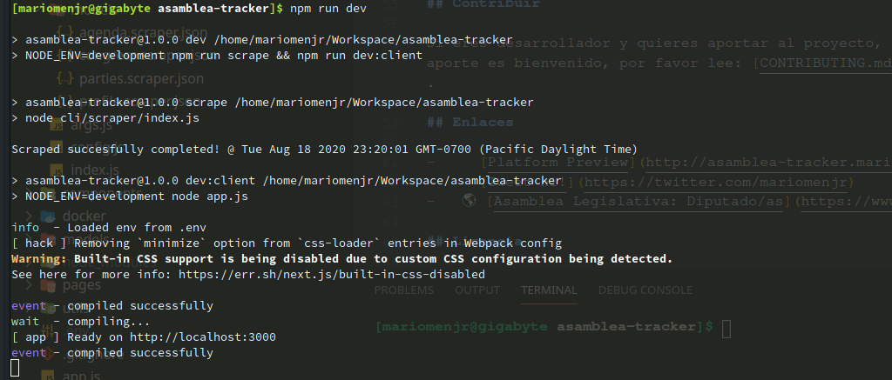
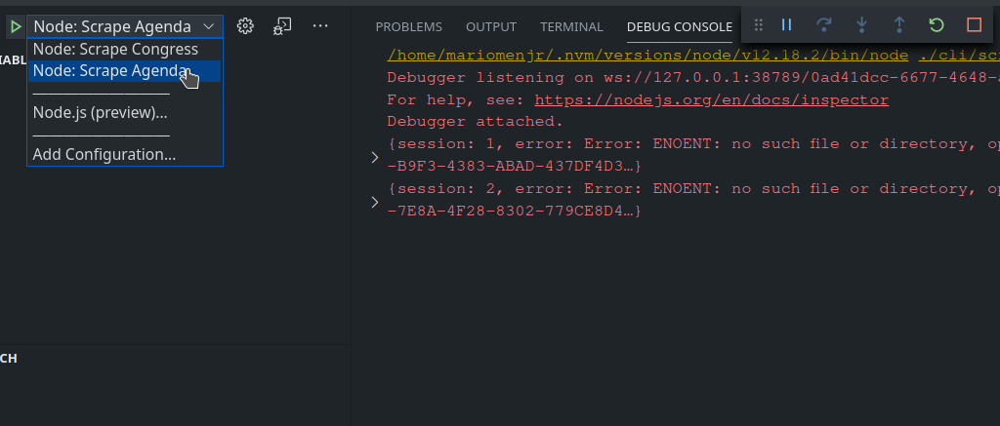

# Asamblea Tracker

> Puedes acceder a la plataforma mientras se construye haciendo click en el siguiente [enlace](http://asamblea-tracker.mariomenjr.com/).

## Requisitos

-   nodejs v10.16+
-   npm v6.9.0+
-   mongodb (Recomiendo abrir una cuenta en [mlab.com](mlab.com), para facilitar las cosas)

> Es requerido crear una base de datos, más no las colecciones. De eso se encargará el sistema.

## Instalación

```bash
$ git clone https://github.com/mariomenjr/asamblea-tracker.git
$ cd asamblea-tracker
$ npm install
```

## Variables de entorno

Debes crear un archivo .env, en el root del proyecto, con las siguientes variables:

```text
MONGO_USER=usuario
MONGO_PASS=password
MONGO_DB=nombre_base_datos
MONGO_HOST=host_name_o_dirección_ip
MONGO_PORT=puerto_de_mongo
```

## Ejecución

Este sistema consta de dos partes. La parte de línea de comandos, la qué se encarga de scrapear la información, y la parte web dónde se presenta la información.

### CLI

Se encarga de scrapear la información de perfil de los diputados:

```bash
$ npm run scrape
```

Se encarga de scrapear las listas de asistencia (archivos PDFs) y ponderar la asistencia:

```bash
$ npm run scrape agenda
```

### Web

```bash
$ npm run dev:client
```

### Atajo

Al ejecutar el comando:

```bash
$ npm run dev
```

Estamos ejecutando el _scrape_ de perfil y el _dev:client_. Cómo puedes ver en la imagen:



### Depuración

Para la sección de línea de comandos (la encargada de hacer scraping), he dejado dos acciones en de depuración.



Si lo tuyo es el `console.log` a diestra y siniestra, tranquil@, I won't judge you.

## Contribuir

Si eres desarrollador y quieres aportar al proyecto, muchas gracias, cualquier aporte es bienvenido, por favor lee: [CONTRIBUTING.md](./.github/es/CONTRIBUTING.md).

## Enlaces

-   [Platform Preview](http://asamblea-tracker.mariomenjr.com/)
-   [Tweet hi!](https://twitter.com/mariomenjr)
-   🌎 [Asamblea Legislativa: Diputado/as](https://www.asamblea.gob.sv/diputados)

## Licencia

El código de este proyecto está bajo [licencia MIT](./LICENSE).
